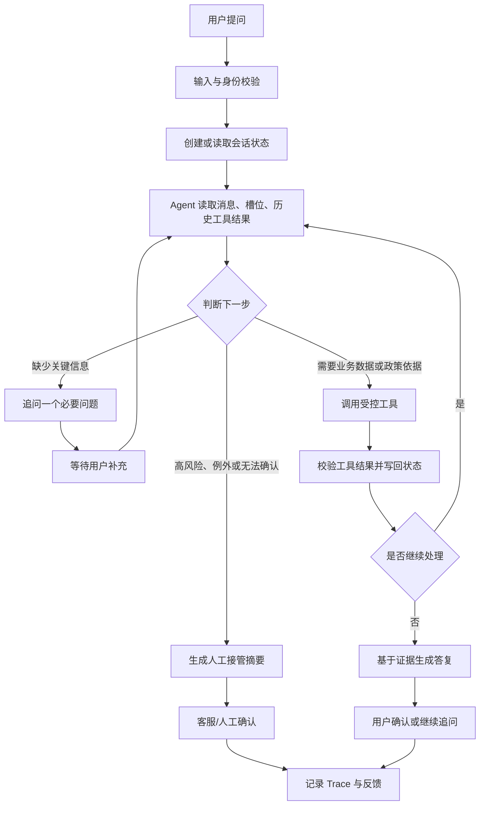

# Commerce Operations Agent

## Multimodal customer-service MVP (2026-09)

Store chat accepts image and voice demo metadata. A synthetic adapter may propose device/SKU candidates, but final compatibility, policy, order, and after-sales decisions remain controlled-tool decisions. Attachment bytes are not uploaded or retained. Safety signals such as a damaged battery must always hand off to a human.

## Agent runtime and quality requirements (normative supplement)

This PRD states **what outcome the product must provide**, not the exact wording of every Dify prompt. Prompt text, slot extraction examples, workflow-node details, model choice, and badcase fixtures are maintained separately so that they can improve without silently changing product or safety requirements.

Every supported chain must have the following product-level acceptance criteria:

| Chain | Required user outcome | Required factual basis | Escalation condition |
|---|---|---|---|
| Recommendation | Relevant, complementary candidates or one focused clarification | Merchant-scoped catalogue attributes and source/timestamp | Missing constraints, incompatible candidates, unavailable/uncertain facts |
| Compatibility | Clear compatible/incompatible/unknown answer with limitations | Versioned compatibility rule and declared device/product fields | Missing facts, ambiguous adapter/power conditions, safety risk |
| Policy | Applicable policy scope and effective evidence | Region/topic/effective-date policy record | Exception, expired/missing policy, request to execute an outcome |
| Order/logistics | Minimal verified order/shipment answer | Tenant-scoped order data after required ownership check | Failed ownership, data mismatch, carrier/system failure |
| After-sales | Safe explanation and structured human-support request when appropriate | Verified order/policy evidence and risk classification | Refund, cancellation, address, inventory, payout, exception, or safety request |
| Multimodal | Safe text/voice/photo-assisted clarification or answer | Validated metadata plus controlled-tool evidence | Low confidence, unsafe electrical/battery signal, identity/ownership claim |

The runtime implementation of Model, Planner, Tool use, Memory, and Harness is specified in [AGENT_RUNTIME_SPEC.md](runtime/AGENT_RUNTIME_SPEC.md). Dify-derived workflow details are governed by [DIFY_WORKFLOW_SPEC.md](runtime/DIFY_WORKFLOW_SPEC.md); regression and release evidence is governed by [评测规范.md](agent评测/评测规范.md). These documents are part of the MVP-to-production acceptance baseline.

## 2026-09 MVP 运行时决策补充

对外售卖的 B 端产品是 **ShopPilot Commerce Agent**，付费客户是跨境 3C 独立站商家。消费者使用商家站内的 **ShopPilot AI Assistant Widget**；客服、运营和管理员使用 **ShopPilot Commerce Agent Console**。它们是不同入口和界面；正式产品可共享统一身份平台，但消费者不登录商家后台。

本 MVP 的店铺客服使用统一 Commerce Agent 运行时：推荐、兼容性、政策、订单/物流与人工接管都通过受控工具完成。原 Dify workflow 只作为可追溯的迁移来源、历史对照和评测基准，不是 ShopPilot Store 的运行时依赖。所有当前数据仍为合成数据，不连接真实 Shopify 或商家系统。

> 2026-09 B2B 产品扩展：本产品的付费客户是跨境 3C 独立站商家。消费者使用嵌入商家网站的 Widget；商家客服、运营和管理员使用 Merchant Console。以下首阶段仅用两家合成商家验证隔离与流程，不接入真实商家数据或系统。

## B2B 多租户产品定义（第一阶段）

### 产品边界

1. **Widget（消费者侧）**：商家把一段脚本嵌入独立站，消费者无需平台账号即可进行售前咨询、订单/物流查询、政策查询与人工接管申请。
2. **Merchant Console（商家侧）**：同一身份平台未来可统一登录，但消费者 Widget 与商家后台始终是不同入口、不同权限和不同页面。首阶段使用明确标识的合成角色选择器演示客服、运营、商家管理员视图，不能视作真实登录。
3. **平台管理端（后续）**：面向产品运营方，独立于商家后台；不在本阶段实现。
4. **租户边界**：每个请求都带 merchant_id；商品、订单、会话、工单、指标和 Widget 配置只能在该商家范围内读取。第一阶段以独立合成数据实例演示，不等同于生产数据库行级隔离。

### 首阶段验收场景

| 场景 | 验收结果 |
|---|---|
| 两家演示商家 | Widget 可通过 merchant_id 加载不同品牌配置和合成数据 |
| 消费者咨询 | 订单号、身份后四位仅查询所属商家的合成订单；风险售后只生成模拟工单 |
| 商家客服 | 仅能看到本商家的模拟工单，且可更新模拟工单状态 |
| 商家运营 | 仅能看到本商家的合成指标、转人工原因与 Widget 安装片段 |
| 越权与未知租户 | 返回清晰错误，不泄露其他商家数据 |

> 项目定位：面向跨境电商的可部署运营智能体。首发以跨境 3C 为例，覆盖售前、订单、物流与退换售后；底层通过可替换的工具适配器支持 Shopify、ERP、OMS、WMS、CRM 等系统，不绑定某一平台。

## 1. 背景与问题

跨境电商用户和客服经常需要在商品参数、设备兼容性、库存、订单、承运商轨迹、退换政策之间来回查询。传统 FAQ 只能回答固定问题；人工客服需要跨多个后台核实，容易出现答复慢、引用过期政策、误判兼容性或遗漏异常的情况。

现有 3C 项目已验证“商品推荐、兼容性、政策问答与转人工”的工作流价值，但知识主要来自静态 CSV，尚未形成真实工具调用、持久状态、订单数据和可部署服务。本项目升级目标是将其变为工程化的 Agent MVP。

## 2. 目标与非目标

### 2.1 目标

1. 让 Agent 根据当前会话状态动态决定追问、检索、查询商品/订单/物流工具或转人工。
2. 以受控工具查询结构化商品、库存、订单、物流、政策和工单数据；所有首版数据均为脱敏模拟数据。
3. 对兼容性、退换资格和高风险售后结论提供字段/政策依据，不让模型自由编造。
4. 提供前端可体验链路、后端 API、会话持久化、Trace、评测与 Docker 部署。

### 2.2 非目标

1. 首版不连接真实商家生产系统，也不实际扣库存、退款、取消订单或修改地址。
2. 不替代客服人员做赔付、退款、例外审批或安全结论。
3. 不做泛化多 Agent 平台；先将单个有状态、多工具 Agent 做稳定。

## 3. 用户与场景

| 角色 | 核心任务 | 典型问题 |
|---|---|---|
| 消费者 | 下单前确认是否适合购买 | “我的 MacBook 能用这个充电器吗？” |
| 消费者 | 查询订单与物流、了解退换政策 | “订单 10023 到哪里了？现在能退吗？” |
| 客服 | 快速核实并获得带依据的答复草稿 | “为什么这个订单需要转人工？” |
| 运营/管理员 | 维护数据、查看失败与转人工情况 | “哪些政策问题未命中最多？” |

## 4. MVP 范围

### 4.1 首版能力

1. **售前决策**：需求追问、商品筛选、兼容性判断、可售与库存查询、政策依据回答。
2. **订单与物流查询**：基于订单号和必要身份校验查询订单状态、包裹号、模拟承运商轨迹与异常原因。
3. **退换售后分流**：根据订单状态、购买日期、商品类型与政策初步判断是否满足标准条件；边界或例外情况生成客服工单草稿。
4. **人工接管**：高风险、资料不足、工具失败或多轮未解决时，输出事实摘要、已查证据、待确认项并创建模拟工单。
5. **运营闭环**：记录会话、工具调用、错误、转人工与用户反馈；后台展示基本指标和 badcase 列表。

### 4.2 后续扩展

评论聚类、市场调研、竞品价格、物流询价、邮件处理、真实 Shopify/ERP/OMS/WMS/CRM 接入、客服系统双向同步。

## 5. 主流程

`用户提问 → 身份/输入校验 → 创建或读取会话状态 → Agent 读取消息、已知槽位和历史工具结果 → 判断下一步 → 追问或调用受控工具 → 工具结果写回状态 → Agent 输出带依据的结果或转人工 → 用户确认/客服接管 → 记录 Trace 与反馈。`

### 5.1 Agent Loop（产品流程图）

下面的回边表示 Agent 不会在调用一次工具后就结束，而是把工具结果写回状态，再回到“判断下一步”；直到信息足够、达到最大步数，或触发人工接管。

其中 `D → E → G → H → I → D` 是核心 Agent Loop；`D → E → F → U → D` 是补充信息后的循环。循环受最大 6 步、工具超时和重复失败次数限制，超过限制就进入人工接管或可理解的降级答复。

Agent 可调用的动作：

| 动作 | 触发条件 | 输出 |
|---|---|---|
| 追问 | 设备、订单号、国家等关键条件缺失 | 单个最必要的问题 |
| 商品搜索 | 已具备基本需求 | 候选 SKU 与字段依据 |
| 兼容性校验 | 有设备与 SKU/候选商品 | 确定性结果、缺失条件、规则版本 |
| 政策检索 | 询问物流、保修、退换、地区可售 | 生效政策片段与适用范围 |
| 订单/物流查询 | 有订单号且通过身份校验 | 订单、包裹、轨迹或异常状态 |
| 创建工单 | 高风险、例外、工具失败或无法确认 | 可供客服处理的结构化摘要 |

## 6. 前端需求

### 6.1 页面

1. **首页/预咨询表单**：收集设备、地区、预算、用途等可选信息。
2. **对话页**：流式答复、追问快捷选项、商品卡、引用依据、工具执行状态与转人工入口。
3. **订单查询页**：订单号与身份校验输入，展示订单、物流轨迹、售后资格和异常说明。
4. **客服工单页**：展示 Agent 摘要、证据、待确认项和人工处理状态。
5. **运营看板**：任务完成率、工具成功率、转人工率、常见未命中问题、平均步骤数与延迟。

### 6.2 交互原则

1. 只展示对用户有意义的工具状态，例如“正在核对兼容性/查询订单”，不展示模型内部推理。
2. 商品、政策、订单结论均展示来源或更新时间；不确定内容必须说明原因。
3. 对退款、地址修改、赔付等动作只允许“提交人工处理申请”，不得在前端自动执行。

## 7. 业务对象与数据

| 对象 | 关键字段 |
|---|---|
| Product / SKU | 型号、接口、功率、价格、地区、兼容规则版本、库存 |
| Policy | 国家、主题、生效日期、失效日期、适用商品、条款、来源 |
| Order | 订单号、用户标识、SKU、数量、支付/履约/售后状态、购买日期 |
| Shipment | 包裹号、承运商、节点、预计送达时间、异常码 |
| Ticket | 工单号、问题类型、摘要、证据、风险等级、处理状态 |
| Conversation | thread_id、用户消息、槽位、工具结果、最终结果、反馈 |

## 8. 规则与治理

1. 兼容性由规则工具基于接口、功率和设备字段判断；模型只能解释，不能覆盖规则结果。
2. 订单查询需验证订单号与脱敏邮箱/手机号后缀；首版使用模拟校验。
3. 工具分为只读与写入两类；首版唯一写操作是创建模拟工单，需使用幂等键。
4. 最大 Agent 步数为 6；工具超时、参数不合法或多轮无结果时降级为补充信息或转人工。
5. 保存 request_id、thread_id、模型版本、Prompt 版本、工具参数、结果、耗时和错误码；日志不记录完整敏感身份信息。

## 9. 指标与验收

| 维度 | MVP 指标 |
|---|---|
| 结果 | 商品/政策依据一致率、兼容性判断准确率、订单字段正确率 |
| 过程 | 工具选择正确率、工具参数正确率、平均步骤数、循环中断率 |
| 安全 | 高风险转人工正确率、越权查询拦截率、写操作重复率 |
| 体验 | 任务完成率、平均响应/P95 延迟、用户追问轮数、转人工后摘要可用率 |
| 工程 | API 成功率、工具成功率、Trace 覆盖率、部署健康检查通过率 |

验收以现有核心 30 条、泛化 100 条、兼容性 badcase 为基础，并新增订单、物流、退换场景的模拟测试集。所有指标必须由实际运行结果填写，不预设提升百分比。
