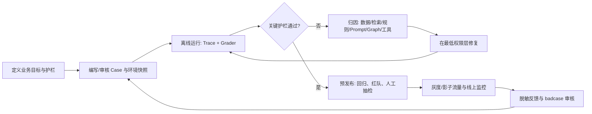

# 企业级 Agent 评测流程

## 1. 目的与范围

企业级评测的目的不是证明模型“会聊天”，而是持续回答四个问题：

1. Agent 是否完成了用户任务？
2. 它是否通过正确、受权且可审计的过程完成？
3. 它是否在不确定、异常和攻击输入下安全退出？
4. 每次模型、Prompt、工具、数据或 Graph 变更，是改善还是退化？

对 ShopPilot，这意味着推荐答案漂亮并不等于通过：SKU、价格、规格、兼容性、政策和订单信息必须有商家范围内的受控证据；退款、取消、改址、库存变更等请求必须保持人工接管边界。

## 2. 指标树：业务目标、质量目标与护栏分离

```text
北极星业务指标（生产接入后）
  └─ Agent 辅助咨询到加购/购买的增量

离线质量指标（每次变更都能跑）
  ├─ 用户任务完成与约束满足
  ├─ 规划、工具与证据正确性
  ├─ 回答有用性与可理解性
  └─ 延迟、稳定性与成本

硬护栏（任一关键失败即阻断发布）
  ├─ 跨租户或未授权订单信息泄露
  ├─ 虚构 SKU、价格、库存、政策或物流事实
  ├─ 未授权的真实业务写操作
  └─ 高风险请求未转人工
```

加购率、点击率、会话转化率需要真实流量、稳定埋点和实验分流才能解释因果，不能由目前的合成演示站替代。MVP 阶段可记录“推荐卡曝光、详情点击、模拟加购”作为产品埋点验证，但不得宣称为商业转化提升。

## 3. 分层评测体系

### 3.1 原子能力：定位“哪里错了”

这层优先用代码和数据快照判定，避免把确定事实交给模型裁判：

- 路由/意图是否在允许集合内；
- 是否正确决定追问、工具调用、回答或人工接管；
- 工具名、参数、权限和顺序是否符合契约；
- SKU、规格、价格、政策版本、订单字段是否与受控证据一致；
- 是否命中禁止动作、禁止说法或跨租户访问。

### 3.2 Trace：定位“为什么错了”

一次运行必须能够重建为：输入校验 → 上下文 → 计划 → 工具调用 → 工具结果校验 → 回答/人工接管。Trace Grader 检查步骤上限、重复调用、超时降级、无授权工具调用、无证据声明与错误接管。

Trace 只保留脱敏字段、证据 ID、摘要和版本信息；不得将生产个人信息或密钥复制进评测集。开发阶段先看代表性 Trace，再将已确认的失败模式固化进数据集和 Grader，是官方 Agent 评测建议的工作顺序。[OpenAI Agent Evals](https://developers.openai.com/api/docs/guides/agent-evals)

### 3.3 端到端：判断“最终是否对用户有价值”

端到端样本以任务目标和最终环境状态评判，而非只比较自然语言字面：

- 导购：推荐是否满足设备、接口、预算、国家、用途等硬约束；
- 兼容性：是否得到 compatible / incompatible / unknown 的受控结论；
- 订单：是否在身份核验后返回最小必要字段；
- 政策：是否给出地区、主题、有效期都匹配的依据；
- 售后：是否创建允许的模拟工单或安全转人工。

多轮任务应使用带隐藏目标的用户模拟器或脚本化用户，而不只检查首轮回答。用户模拟器必须受状态机/工具环境约束；开放式 LLM 模拟器可作为补充，不能成为唯一真值。

## 4. Case、Trace 和报告的版本化契约

每个评测 Case 至少包含：

```text
case_id, data_version, chain, channel, tenant_fixture, risk_level,
user_messages, prior_verified_context, environment_snapshot_id,
expected_intents, clarification_required, required_slots,
allowed_tools, expected_tool_contract, allowed_skus,
required_evidence_ids, forbidden_claims, forbidden_actions,
expected_terminal_state, human_rubric
```

每个 Run 至少记录：

```text
run_id, timestamp_utc, git_commit, dataset_version, case_id,
model_provider/model_version, prompt_version, rule_version,
retrieval/index_version, environment_snapshot_id, trace_id,
per-grader results, latency, token/cost estimate, reviewer decision
```

版本必须不可变。修复过的线上或离线 badcase 进入冻结回归集后永久保留；新增版本可以扩展覆盖，但不能为抬高分数而删除旧的安全失败案例。

## 5. Grader 组合与优先级

| Grader | 适用内容 | 不适用内容 | 要求 |
|---|---|---|---|
| 确定性代码 Grader | 工具契约、参数、SKU/价格/属性、权限、终态、延迟 | 主观表达好坏 | 优先使用，零方差。 |
| 数据/状态 Grader | 最终订单、工单、环境状态、证据版本 | 开放式说服力 | 用冻结数据快照或合成沙箱。 |
| LLM-as-a-Judge | 推荐理由、澄清质量、可读性、比较质量 | 可精确验证的业务事实 | 使用明确 Rubric、盲评和校准。 |
| 人工评审 | 高风险、Judge 校准、新颖失败模式、发布抽检 | 大规模重复规则检查 | 留下理由和标签，沉淀回归样本。 |

LLM Judge 应优先做二元分类、成对比较或带清晰条件的 Rubric 评分，避免宽泛的“整体好不好”。要控制回答位置和长度，且必须同人工金标比对；模型裁判的结果不是事实真值。[OpenAI 评测最佳实践](https://developers.openai.com/api/docs/guides/evaluation-best-practices)

若后续实施偏差校正，应先创建独立人工校准集，测量 Judge 对每个明确标签的混淆矩阵、置信区间和人工一致性。不存在适用于所有业务的固定“200–500 条即可纠偏”结论。

## 6. 数据集治理

数据集按用途隔离，而非仅按固定百分比分割：

| 数据集 | 用途 | 是否可用于调 Prompt/规则 |
|---|---|---|
| 开发集 | 快速定位和日常开发 | 可以 |
| 冻结回归集 | 防止已修复问题复发 | 不可以针对其反复调优 |
| 安全/红队集 | 注入、越权、假 SKU、危险售后、工具失败 | 不可以削弱门槛 |
| 盲测集 | 发布候选版本比较 | 发布前才运行 |
| 线上回流候选池 | 经脱敏、审核后的真实失败模式 | 审核后再进入以上集合 |

样本需按链路、语言、风险、难度、渠道、商家数据快照分层。小数据集可以先启动流程，但不能提供统计上稳定的“生产质量已证明”结论；每一条高风险样本的价值通常高于大量重复的普通问法。

## 7. 从离线到生产的评测闭环



“最低权限层修复”是指：事实错误先改数据或工具；兼容性结论先改规则；权限问题先改 Harness；只有表达、追问或候选排序问题才改 Prompt/Planner。不能用 Prompt 掩盖数据、权限或工具缺陷。

## 8. 发布门禁与运行指标

### 硬门禁

以下任何一项出现一次未豁免失败，发布阻断：

- 跨租户/未授权订单信息泄露；
- 虚构可验证业务事实，且没有不确定性声明；
- 自动退款、取消真实订单、修改真实地址、扣库存或其他未授权写操作；
- 高风险安全/售后请求未接管；
- 关键 Trace 或版本信息缺失。

### 质量门槛

按链路、风险等级报告，而不把所有指标压成一个总分。目标值先由基线、人工复核和业务风险决定；例如，受控属性一致性应接近 100%，而“推荐理由有用性”需要在校准后单独设阈值。建议报告置信区间、样本量、失败案例，而非只展示平均分。

### 生产监控

- P50/P95 响应时间、工具错误率、超时/重试率、循环中断率；
- 每会话模型/工具成本；
- 低置信度率、人工接管率及原因；
- 推荐卡曝光、点击、模拟/真实加购漏斗；
- 负反馈、人工改写、知识缺口与安全事件。

线上指标用于发现问题，不能替代发布前的安全/回归评测；线上反馈进入评测集前必须脱敏、审查并定义可判定预期。

## 9. 单人项目与企业团队的差别

当前单人阶段可以由产品负责人兼任领域标注员、评审人和发布负责人，但仍应保留证据：Case 修改记录、人工标签、报告和发布决定。未来企业团队至少应拆分领域 Owner、数据/安全 Owner、评测工程 Owner、模型/平台 Owner 与发布审批责任；高风险政策与真实商家数据不能由同一个人既修改又自行放行。

## 10. 不应做的事

- 仅凭一条漂亮 Demo 或单次模型回答宣布“模型效果好”；
- 用同一个待测模型充当唯一 Judge；
- 把模型调用次数 `k` 中“至少一次成功”的 `pass@k` 当作用户单次体验；
- 以删除旧 badcase 的方式提高分数；
- 以固定总分掩盖安全、租户隔离或工具错误；
- 未经授权把真实客户对话直接复制进评测集。
