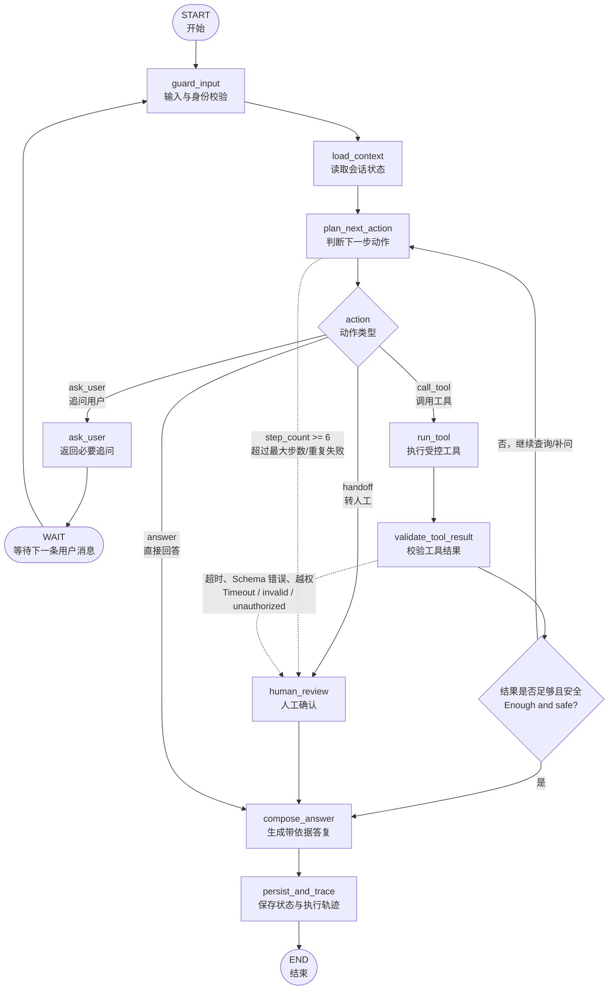

# Commerce Operations Agent 技术架构

## 多模态输入

`附件元数据 → 校验 → 合成视觉/STT 适配器 → 置信度与安全门 → Commerce Graph`。首版不会存储媒体字节；生产环境需要经过审批的模型适配器、租户隔离的加密对象存储、短时上传 URL、文件扫描、EXIF 清除、留存/删除控制和多模态 badcase 评测。

## 运行时状态：当前实现与生产目标

当前仓库已有 LangGraph 状态机骨架、确定性受控工具，以及面向仓库内合成政策/FAQ/商品知识的本地可审计混合 RAG；尚无真实商家数据或生产授权。RAG 使用本地 Hashing Embedding + BM25，以保证开发可复现，不是生产级语义 Embedding 或持久化 pgvector 部署。特别是现有 `planner` 节点仍是规则/关键词路由，`validate` 是 MVP 安全校验，不能描述为完成的模型驱动 ReAct 系统。

生产目标仍为 `guard -> scoped memory -> typed plan -> controlled tool -> validation -> compose/handoff -> trace`。模型只可在 Schema 校验后的规划与基于证据的表达中提供辅助；工具权限、租户范围、规则决策与安全出口均由护栏控制，而非模型文本。权威运行时契约见 [AGENT_RUNTIME_SPEC.md](runtime/AGENT_RUNTIME_SPEC.md)，Dify 映射见 [DIFY_WORKFLOW_SPEC.md](runtime/DIFY_WORKFLOW_SPEC.md)，可量化发布门槛见 [评测规范.md](agent评测/评测规范.md)。

## 2026-09 统一客服运行时补充

```text
ShopPilot 3C Store / embedded Widget
        -> Next.js BFF (/api/agent/chat)
        -> FastAPI Commerce Agent
        -> deterministic catalogue / compatibility / policy / order / ticket tools
        -> repository-packaged synthetic CSV + synthetic state
```

Dify 不位于上述店铺运行时链路。`docs/dify/` 保存导出 DSL，`src/backend/commerce_agent/data/` 保存审查后的合成 CSV；运行时再将其与合成扩展目录转换为带版本/地区元数据的 RAG 文档。详细实现见 [RAG_IMPLEMENTATION.md](runtime/RAG_IMPLEMENTATION.md)。此结构避免 Dify 与 Agent 对同一客户问题做竞争决策。生产阶段再把此确定性工具层扩展为 LangGraph 检查点、PostgreSQL RLS、经审批的连接器与 OIDC。

## B2B 多租户演示架构（第一阶段）

```text
消费者浏览器 → 商家独立站中的 Widget → Next.js BFF → FastAPI Widget API
商家员工浏览器 → Merchant Console       → Next.js BFF → FastAPI Console API
                                                       → 合成租户注册表
                                                       → 每租户独立的合成 Agent / Store
```

`merchant_id` 是 Widget、商家后台、会话、工单和指标的强制范围字段。Widget 仅通过 Next.js 服务端代理访问 Agent；Merchant Console 同样不直连数据库或模型服务。当前实现用独立内存/SQLite 合成 Store 表达两个租户，目的是验证产品流程与越权拦截；正式 SaaS 需要 PostgreSQL tenant_id、复合索引、数据库行级安全、OIDC 组织/成员/角色映射、审计与真实连接器审批，均不在本阶段。


## 1. 技术选型

| 层级 | 方案 | 原因 |
|---|---|---|
| 前端 | Next.js + React + TypeScript | 复用现有 3C 前端和组件能力 |
| API 服务 | FastAPI + Pydantic | 适合 Python Agent、Schema 校验与异步 API |
| 编排 | LangGraph | 显式状态机、循环、持久化、人工中断与可视化图结构 |
| 模型接入 | LangChain Model Adapter / LiteLLM 可选 | 统一接入 Qwen、豆包、DeepSeek 等模型并保留替换能力 |
| 结构化数据 | PostgreSQL | 商品、政策、订单、工单、会话与审计数据 |
| 向量检索 | pgvector（首版） | 减少额外服务；后续可替换 Qdrant |
| 缓存与限流 | Redis | 热数据缓存、请求限流、短期会话与异步任务 |
| 部署 | 独立 Docker Compose + Nginx/Caddy | 本项目独立运行、独立数据隔离；后续可迁移云容器/Kubernetes |
| 观测 | OpenTelemetry/Sentry + LangSmith 可选 | 错误、性能与 Agent Trace 分层记录 |

## 2. 系统架构

```text
Browser
  → Next.js Frontend
  → Nginx / API Gateway
      - HTTPS、CORS、JWT、限流、Request ID
  → FastAPI Agent API
      - /chat、/orders、/tickets、/health、/metrics
  → LangGraph Commerce Graph
      - Guard → Planner → Tool → Validate → Respond / Handoff
  → Tool Service Layer
      - catalog / compatibility / policy / order / shipment / ticket
  → PostgreSQL + pgvector / Redis / LLM Provider
```

## 3. 前后端边界

### 3.1 前端

前端只负责用户输入、会话展示、商品卡、引用依据、工单提交与运营看板。模型 Key、数据库连接、订单校验、工具调用和策略判断只存在于后端。

`POST /api/v1/chat` 输入：`thread_id`、`message`、可选槽位；输出使用 SSE 依次返回 `status`、`tool_result_summary`、`answer`、`handoff` 事件。

### 3.2 后端

FastAPI 负责鉴权后的 API、会话生命周期、Agent 调用、输入输出 Schema、工具适配、审计和异常映射。LangGraph 不直接被浏览器调用，也不直接执行 SQL。

## 4. LangGraph 设计

### 4.1 State

```python
CommerceState = {
  "thread_id": str,
  "messages": list,
  "intent": str | None,
  "slots": dict,
  "missing_slots": list[str],
  "candidate_skus": list[dict],
  "evidence": list[dict],
  "tool_results": list[dict],
  "risk_level": str,
  "step_count": int,
  "handoff": dict | None,
}
```

### 4.2 Nodes

1. `guard_input`：长度、敏感输入、身份和线程校验。
2. `load_context`：从 Checkpoint 读取本线程状态，压缩过长消息。
3. `plan_next_action`：在工具白名单内输出结构化动作：追问、工具名、回答或转人工。
4. `run_tool`：通过工具注册表调用只读或受控写入工具。
5. `validate_tool_result`：校验结果 Schema、时间戳、权限和业务规则。
6. `human_review`：对高风险转人工、工单创建或异常结果使用 `interrupt`。
7. `compose_answer`：仅根据工具结果与引用证据生成对用户可见答复。
8. `persist_and_trace`：保存 Checkpoint、审计与指标事件。

`plan_next_action → run_tool → validate_tool_result → plan_next_action` 构成受最大步数限制的 ReAct 循环；无工具调用时进入答复或人工确认节点。

### 4.3 Agent Loop（LangGraph 路由图）



运行时的真实回路是：

```text
plan_next_action
        ↓ call_tool
run_tool
        ↓
validate_tool_result ──结果不足/需继续──→ plan_next_action
        ↓ 结果充分
compose_answer → persist_and_trace → END
```

因此 `plan_next_action` 是循环控制点，`run_tool` 只负责执行，`validate_tool_result` 负责把工具结果转成下一轮可用状态。`step_count`、工具失败次数、上下文 Token 和超时共同构成循环的停止条件；任何高风险、越权、重复失败或无法核实的情况都绕过继续循环，进入 `human_review`。

## 5. 工具层与适配器

| 工具 | 首版实现 | 未来适配器 |
|---|---|---|
| 商品查询 | PostgreSQL 结构化筛选 | Shopify Catalog、ERP/PIM |
| 兼容性 | Python 规则函数 + 规则版本 | PIM/规则引擎 |
| 政策检索 | pgvector + 元数据过滤 | CMS、知识库 |
| 库存查询 | PostgreSQL 模拟库存 | ERP/WMS |
| 订单/物流 | PostgreSQL 模拟订单和轨迹 | Shopify/OMS、Shippo/承运商 API |
| 创建工单 | 本地 ticket 表，幂等写入 | Chatwoot、Zendesk、CRM |

所有工具先定义 `name`、`description`、Pydantic 输入模型、返回模型、权限等级、超时和重试策略。Agent 只能调用注册表中的工具。

## 6. 数据与记忆

1. **业务数据**：商品、政策、订单、物流、工单均存 PostgreSQL；首版用 CSV 初始化种子数据。
2. **短期记忆**：LangGraph Checkpointer 以 `thread_id` 保存多轮槽位、工具结果和消息摘要。
3. **长期记忆**：首版只保存用户显式确认的偏好，例如常用设备/国家；不得将未确认推测写入长期记忆。
4. **RAG**：政策文档按国家、主题、生效日期、适用 SKU、语言和可见角色做元数据过滤，再混合检索和重排序。

## 7. 独立部署、网关与运维

本项目的部署命令、网关、备份、CI/CD 和回滚流程见 [部署与运维手册](operations/DEPLOYMENT.md)；本节只保留 3C Agent 的独立资源和项目专属要求。

### 7.1 独立部署原则

3C Agent 是独立产品，不与 Enterprise Agent、NutriChat 共用业务服务和数据。即使三个项目部署在同一台云服务器上，也必须使用独立的 Compose 项目、容器网络、数据库、Redis 命名空间、对象存储目录、密钥和日志空间。可复用 Nginx/Caddy、镜像仓库和监控平台，但不能复用业务数据库账号。

### 7.2 服务、域名与数据隔离

```text
commerce-web      Next.js 前端
commerce-api      FastAPI + LangGraph
commerce-db       PostgreSQL + pgvector，数据库名 commerce_db
commerce-redis    Redis，使用 commerce:* 命名空间
commerce-gateway  Nginx/Caddy
```

演示或生产入口：

```text
https://commerce.example.com       → commerce-web
https://commerce-api.example.com   → commerce-api
```

`commerce-db` 只保存商品、政策、订单、物流、工单和会话；模型 Key、数据库密码和 JWT Secret 单独保存在本项目 `.env` 或云密钥服务中。

### 7.3 本地部署操作

项目代码准备好后，在 GitLab `commerce-operations-agent` 仓库根目录执行：

```bash
cp .env.example .env
docker compose -p commerce-agent -f infra/docker-compose.yml build
docker compose -p commerce-agent -f infra/docker-compose.yml up -d
docker compose -p commerce-agent exec api alembic upgrade head
docker compose -p commerce-agent exec api python -m app.seed
curl http://localhost/health
curl http://localhost/ready
```

本地 Compose 至少启动 `frontend`、`api`、`postgres`、`redis`；`.env` 只在本机保存模型 Key，禁止提交仓库。

### 7.4 服务器部署与网关

服务器上使用独立目录和项目名：

```text
/opt/commerce-agent/
  infra/docker-compose.yml
  infra/nginx.conf
  .env
```

网关将 `commerce.example.com` 转发到前端，将 `commerce-api.example.com` 转发到 API。Nginx/Caddy 负责 TLS、反向代理、SSE 超时、请求体大小、基础限流、CORS 和 `/health`；API 只允许访问 `commerce-db` 和 `commerce-redis`。生产发布顺序为：拉取镜像 → 执行数据库迁移 → 启动新容器 → 检查 `/health` 与 `/ready` → 执行聊天、工具调用和转人工冒烟测试 → 切换流量。

### 7.5 运维、备份与回滚

```bash
docker compose -p commerce-agent logs -f api
docker compose -p commerce-agent restart api
docker compose -p commerce-agent down
docker compose -p commerce-agent up -d --no-build
```

PostgreSQL 按日备份，备份文件进入独立加密目录；回滚时固定回退到上一版镜像并执行兼容的数据库迁移。每个请求生成 `request_id`，贯穿前端、API、Graph 和工具日志。只读工具可有限重试，工单写入带 `idempotency_key`；模型/工具分别配置超时、熔断和降级，Agent 最大 6 步。

## 8. 测试与 CI/CD

1. 单元测试：兼容规则、订单权限、政策过滤、幂等工单。
2. API 测试：Schema、鉴权、超时、错误码、SSE 事件。
3. Agent 评测：既有核心/泛化/badcase 集 + 新增订单、物流、售后测试集。
4. GitLab CI：lint → unit test → eval smoke → build Docker image；主分支通过后部署到演示环境。
